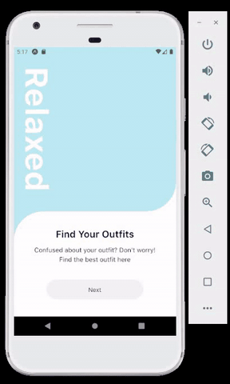

# Day 09

**Date**: 14th Sept, 2020
**Time spent**: 1 hour

## Summary of yesterday

- Finished module 01 of the React Native Fashion youtube playlist
- Successfully setup my react native environment (inc Android studio)

## Learnings

Here's what I built today🎉🎉🎉



> I couldn't fully document my learnings yesterday, so I just layed out the outline to complete the notes today.

- I said I would get to video 4 of the [React Native Fashion]() youtube playlist today. That was a very unreasonable and unrealistic target😅. These particular series is so in-depth that I literally spent about 5 hours to follow through a 50mins video.

### How to use the <ScrollView/> element

- ScrollView in react native is used for rendering a finite number of list items. All items are rendered at once. It's advised to use the `FlatList` or `SectionList` when rendering lists with unknown length (They are batch-rendered). Here's how to use a basic `ScrollView` react-native component.<br><br>
  ```js
    <ScrollView
        horizontal
        snapToInterval={width}
        decelerationRate="fast"
        showsHorizontalScrollIndicator={false}
        bounces={false}
        scrollEventThrottle={1}
        contentInset={top: 2, left: 5, bottom: 2, right: 5}
        onScroll={onScroll}
    >
        {slides.map(({ title }, index) => (
            <Slide key={index} />
        ))}
    </ScrollView>
  ```
- `horizontal`: When set to `true`, the items scroll along the `x-axis` and the scrollbar shows underneath. The default value is `false`.
- `snapToInterval`: Takes a number that causes the scrollView to stop at multiples of the number.
- `decelerationRate`: A floating number or string ("normal", "fast", etc) that determines how quickly the scroll view slows down after the user lifts their finger.
- `showsHorizontalScrollIndicator`: Determines if the scrollbar is shown. Default value is `true`.
- `bounces`: content bounces when it reaches the end of the scroll items. Default is `true`.
- `scrollEventThrottle`: Controls how frequently the `onScroll` event is fired. The default is `0` and a higher number means the events will be fired less frequently.
- `contentInset`: Sets the padding between the inner content of the scrollView and the scrollView itself.

### Getting the viewport sizes (Width, Height) with Dimension

- React native provides us with a `Dimension` variable that carries some information like `height` and `width` of the device window our code runs in. We can access them by doing <br><br>

  ```js
  import { Dimension } from "react-native";
  const { width, height } = Dimensions.get("window");
  ```

### Others

- Using transform & translates
- Using Animated.ScrollView from `react-native-gesture-handler` library

## Challenges

- There was really no challenges today

## Tomorrow's focus

- Complete video 3 of the [React Native Fashion]() series.
